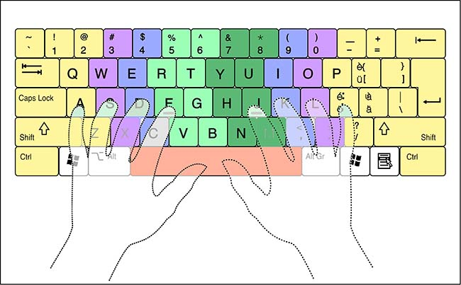
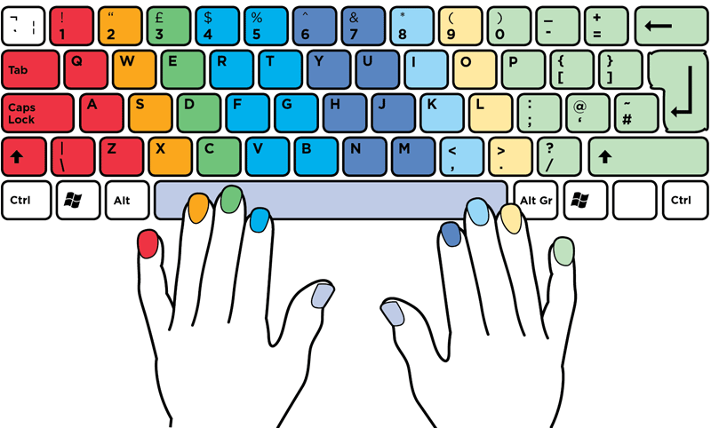
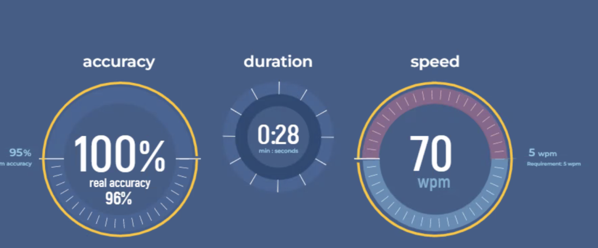
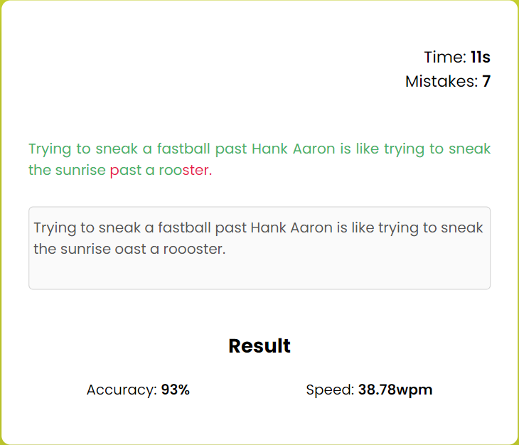

# Test-Typing-Skill

The act of typing involves entering text into a computer or other device using a keyboard or another input method. The goal of typing is to swiftly and effectively transmit thoughts and information, frequently using written language. In many various professions, like writing, programming, data entry, customer service, and more, having good typing abilities is essential. There are other methods for typing quickly and accurately, such as touch typing, which uses all ten fingers without looking at the keyboard, and hunt-and-peck typing, which uses one or two fingers to locate and press each key separately. Overall, the ability to type is crucial for people to successfully communicate and do activities in the digital age.

Because so much of our communication now takes place digitally through computers, cellphones, and other devices, having good typing abilities is particularly crucial. The ability to type rapidly and precisely may improve a person's productivity and efficiency at work as well as their ability to interact and communicate with others.

There are a number of strategies that may be used to assist people get better at typing. In order to type properly, for instance, you need keep your shoulders relaxed and your back upright. Taking pauses to stretch and relax your hands and wrists can also be beneficial, especially if you type for long stretches of time.

Practise is another important element in improving one's typing abilities. Regularly doing typing drills and exercises will help you increase your accuracy and speed. There are several websites that provide free typing exercises and games to help you improve.

Finally, it's important to remember that there are several keyboards available with various features and designs that might affect how you type. While some individuals prefer more compact versions or ergonomic designs that are more comfortable for prolonged use, others might prefer mechanical keyboards for their tactile feedback and durability. Overall, you may build excellent typing abilities that will help you in both your personal and professional life by putting an emphasis on proper technique, practise, and selecting the correct keyboard for your purposes.


# Fast Typing Technique

The following quick typing methods will help you increase your typing speed and accuracy:

- Using good finger placement on the keyboard is one of the most crucial aspects of typing quickly. To reduce mobility and boost productivity, each finger should be allocated to a certain set of keys.



- Touch typing: By typing without glancing at the keyboard, you can concentrate on the screen and type more quickly. To use this strategy, it's crucial to remember where each key on the keyboard is located.



- Practise your typing skills on a regular basis to increase both your speed and accuracy. You may improve your typing abilities by taking advantage of the numerous online typing classes and exercises available.



- Learn keyboard shortcuts so that you can type faster and more efficiently. To speed up your work, try learning the standard keyboard shortcuts for your operating system and software programmes.

- Avoid Hunt-and-Peck Typing: This technique involves staring at the keyboard while using only a few fingers to type. Comparing this approach to touch typing, it is sluggish and ineffective.

- Maintain Proper Posture: Sit up straight with your shoulders back and relaxed, feet flat on the ground. This aids in easing stress and avoiding muscular ache.

- Use a Comfortable Keyboard: Your typing speed and accuracy may be greatly improved by using a comfortable keyboard that matches your hand size and typing style.

One may speed up and improve the efficiency of his or her typing by applying these strategies on a regular basis.

# Website Screen Shots


 




## Run Locally

Initialize git 

```bash
  git init
```

Clone the project

```bash
  git clone https://github.com/Souvik2376/Test-Typing-Skill.git
```

Go to the project directory

```bash
  cd Test-Typing-Skill
```

Run the HTML file

```bash
  Run index.html 
```
** Just chnage to the directory and open the index file and run . 

# Test your typing skill 

[Live Demo](https://souvik2376.github.io/Test-Typing-Skill)


